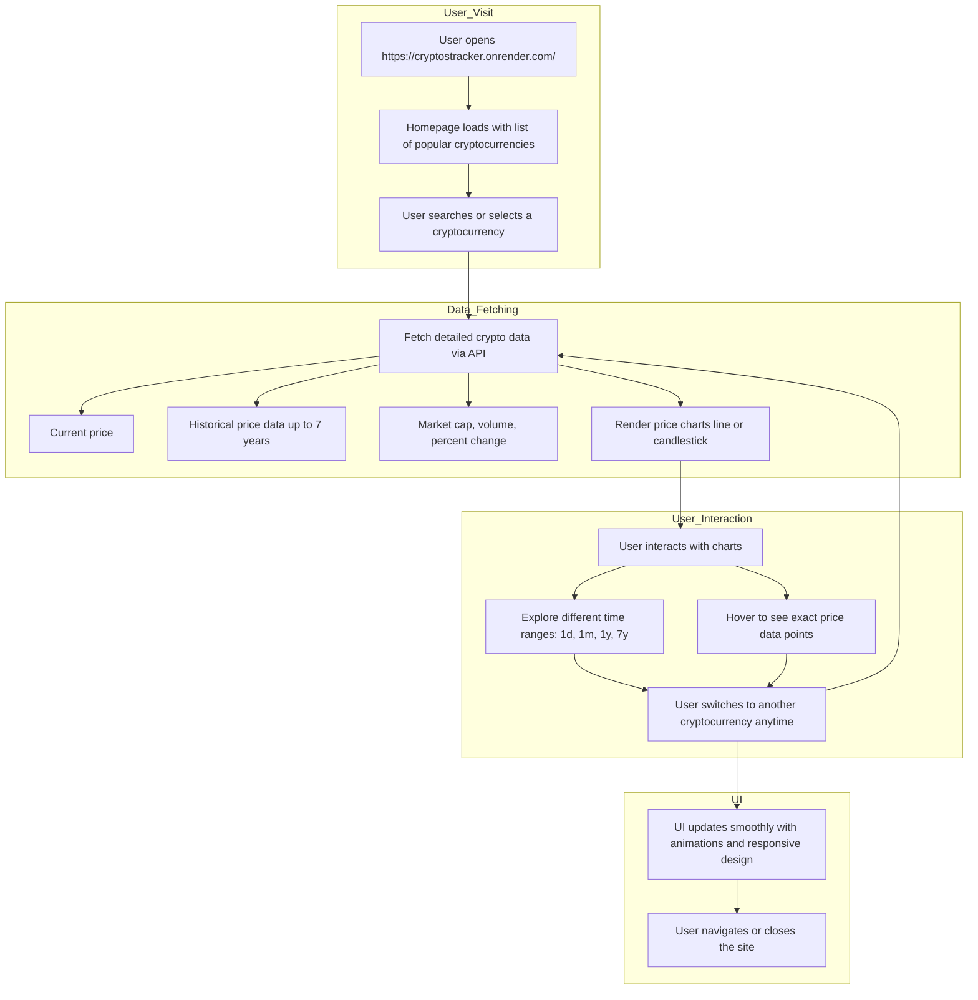

<h1>Cryptocurrency Tracker</h1>

  This project is a simple and user-friendly cryptocurrency tracker built with <strong>ReactJS</strong> and managed using <strong>Yarn</strong>. It provides live price updates for various cryptocurrencies like Bitcoin, Ethereum, and more, helping you stay on top of market trends.

## Project Workflow Diagram

<h2>Features</h2>
<ul>
  <li><strong>Live Price Updates</strong>: Displays real-time cryptocurrency prices fetched from reliable APIs.</li>
  <li><strong>Multiple Cryptocurrencies</strong>: Track popular coins including Bitcoin, Ethereum, and others.</li>
  <li><strong>Responsive Design</strong>: Optimized for both desktop and mobile devices.</li>
  <li><strong>Custom Styling</strong>: Utilizes Styled Components for a modern and maintainable design.</li>
  <li><strong>Magic UI Integration</strong>: Incorporates prebuilt components from Magic UI for a polished user experience.</li>
</ul>

## 🧰 Tech Stack

<h2>How to Use</h2>
<ol>
  <li>Clone the repository to your local machine:</li>
  <pre><code>git clone https://github.com/your-username/cryptocurrency-tracker.git</code></pre>
  <li>Navigate to the project directory:</li>
  <pre><code>cd cryptocurrency-tracker</code></pre>
  <li>Install the dependencies:</li>
  <pre><code>yarn install</code></pre>
  <li>Start the development server:</li>
  <pre><code>yarn start</code></pre>
  <li>Open your web browser and go to <code>http://localhost:3000</code> to view the application.</li>
</ol>

<h2>Project Structure</h2>
<pre><code>
.
├── src
│   ├── components      # React components for the cryptocurrency tracker
│   ├── App.js          # Main application file
│   ├── index.js        # Entry point of the application
│   ├── api.js          # API call functions to fetch cryptocurrency data
│   └── styles.js       # Styled Components for custom styling
└── public
    ├── index.html      # Main HTML file
    └── favicon.ico     # Favicon for the app
</code></pre>

<h2>Future Enhancements</h2>
<ul>
  <li>Add detailed analytics and historical charts for cryptocurrency trends.</li>
  <li>Implement a favorites list for quick access to preferred coins.</li>
  <li>Introduce a dark/light theme toggle for a personalized user experience.</li>
  <li>Improve error handling and user notifications for API request issues.</li>
</ul>
